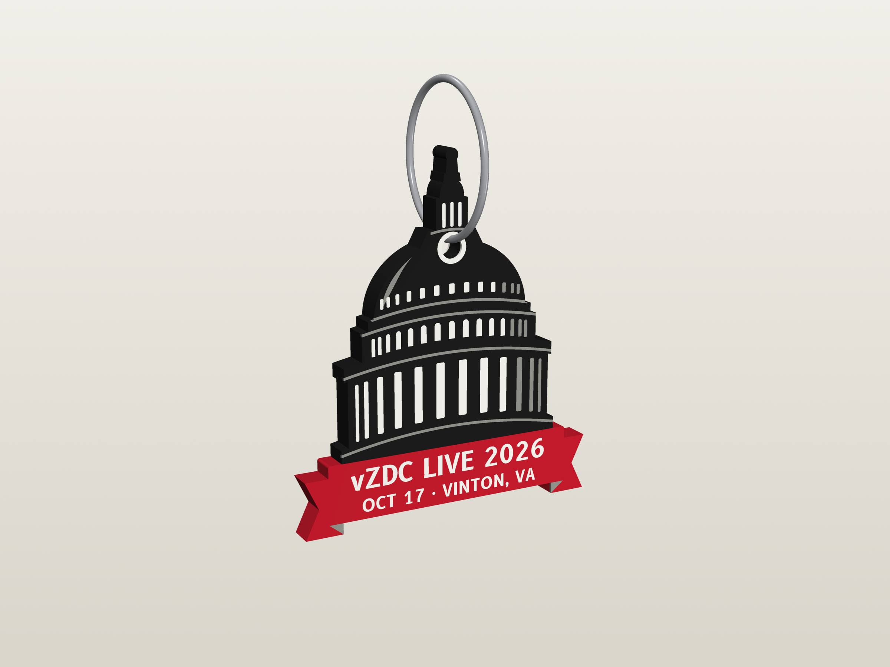

# vZDC Live 2026 keychain

A personalized, four-color 3D-printed souvenir keychain for **vZDC Live 2026** (Virtual Washington
ARTCC, October 17, 2026, Vinton, VA). Shaped like the Capitol dome, printed on a Bambu Lab P2S with
a 0.2 mm nozzle.

One Python script turns a table of attendees into print-ready files: a Bambu Studio project (`.3mf`)
with the four colors already assigned to filament slots, plus one STL per color.


## What it looks like

| | |
|---|---|
|  |  |
| **Front** — the same on every keychain | **Back** — rating, CID and one free text line |

The front carries the dome, the event name and the date. The back carries a rating badge, a CID,
"Virtual Washington ARTCC", and one free text field on the ribbon, so each attendee gets their own
(for example `Carson B. (CB)`).

## Three tops, for the split ring you have

A split ring has to loop from the hole around the material above it, so **the material above the
hole plus the 4 mm thickness must fit through the ring's inner opening**. That decides which top you
can use:

| Version | Height | Material above hole | Smallest ring | Notes |
|---|---|---|---|---|
| `orb` | 57.6 mm | 2.3 mm | **8 mm** | Shortest. The finial itself is the ring boss, so there is nothing thin to snap off. |
| `spire` | 65.4 mm | 2.3 mm | **8 mm** | Keeps the full statue and spire, with the ring boss added above them. |
| `dome` | 57.4 mm | 13.3 mm | **20 mm** (25 mm is comfortable) | The original look: hole through the upper dome, no boss. |

  

The hole is Ø3.4 mm, which takes a doubled 1.2 mm split-ring wire, with at least 2.2 mm of material
all around it.

## Printing

- **Size**: 49.2 mm wide, 4.16 mm thick (30 layers), height per the table above.
- **Colors**: black (body), white (windows, hole ring, text), gray (lines, shading), red (ribbon and
  badge). The ribbon is red through its full thickness; the rest of the core is black.
- **Inlays**: 3 layers of flush color on each face, 0.38 mm on the back and 0.42 mm on the front, so
  both faces stay flat and the top can be ironed.
- **Orientation**: BACK face down on the plate, front face up and ironed. Layer 1 is nothing but
  small colour islands, and the back has about half as many as the front (41 vs 78), so it is the
  safer face to start on. The back is mirrored in the model so it reads correctly once flipped.
- **Layer 1 is all small colour islands**, so it gets special treatment:
  - any island narrower than 0.3 mm is merged into the colour around it (hair-thin slivers lift,
    catch the nozzle and turn the print into spaghetti after a layer or two);
  - **elephant-foot compensation is 0**. The stock profile shaves 0.15 mm off every island, which
    takes a 0.63 mm letter stroke down to 0.33 mm, thinner than one bead, and the text prints
    malformed. With it off, islands ending under 0.5 mm go from 73% to 9%;
  - one wall on layer 1, a 4 mm brim, and 25 mm/s.
- **Slicing**: 0.10 mm first layer then 0.14 mm, 3 walls, ironing on the top (front) surface, purge
  tower on, purge into infill where it fits. The included `.3mf` already sets these. 0.14 mm is the
  most a 0.2 mm nozzle should do and it keeps the colour boundaries to 3 layers a side; printing the
  whole part at 0.10 mm costs 1.6 h and 5 g more purge per plate for no gain, because each face then
  needs 4 colour layers instead of 3.
- **Waste**: a plate needs 42 filament changes whether it holds one keychain or eleven, so always
  print in batches. Measured on a plate of 11: 60.5 g total, 46 g in the parts and 14 g purged, i.e.
  about 1.4 g of purge per keychain instead of about 22 g when printed one at a time. 12.3 h per plate.

Load the `.3mf` straight into Bambu Studio. If you prefer the STLs, select all four at once and
answer **yes** when asked to load them as a single object with multiple parts, then assign a filament
per part.

## Usage

```bash
pip install shapely manifold3d numpy fonttools matplotlib
python keychain.py                                   # every row in attendees.csv, all three tops
python plates.py --csv attendees.csv --top orb       # arrange them onto print plates
python keychain.py --top orb --preview               # one top, plus a PNG of both faces
python keychain.py --text "Carson B. (CB)" --cid 1652726 --rating SUP --top orb
```

`attendees.csv` is the table. One row per keychain:

```csv
text,cid,rating
Carson B. (CB),1652726,SUP
```

- `text` — free text on the ribbon, printed as typed. It shrinks automatically to fit and errors out
  if it cannot (about 14 characters fit at full size).
- `cid`, `rating` — optional; leave either blank and it is left off that keychain.

Output lands in `out/<text>_<cid>_<top>/` as a `.3mf` plus four `.stl` files.

### Plates

`plates.py` packs the keychains onto 256 x 256 mm plates (11 per plate, rotated 90 degrees, with the
purge tower above them) and writes one `.3mf` per plate into `out/plates/`. Add a `group` column to
the CSV and each group starts its own plate, which is how a confirmed list prints before a tentative
one:

```csv
text,cid,rating,group
CARSON BERGET,,,going
ROWAN A YOUNG,,,tentative
```

### Drawings and renders

```bash
python drawing.py --top orb --text "Carson B. (CB)" --cid 1652726 --rating SUP
pip install pyvista
python render.py out/carson_b_cb_1652726_orb --all
```

`drawing.py` writes an A3 engineering drawing at 2:1 ([PDF](docs/keychain_drawing_orb.pdf)) with
dimensioned views, a section through the hole, the layer stack, and a filament table. `render.py`
writes the renders in `docs/`.

## Files

| Path | What it is |
|---|---|
| `keychain.py` | Geometry, text layout, STL and Bambu 3MF writers |
| `drawing.py` | The engineering drawing |
| `render.py` | The 3D renders |
| `attendees.csv` | The table of keychains to make |
| `plates.py` | Packs keychains onto print plates |
| `bambu/p2s_0.2_template.json` | P2S 0.2 mm nozzle print settings the 3MF is built from |
| `fonts/` | B612 and B612 Mono (SIL Open Font License, see `fonts/OFL.txt`) |
| `docs/` | Drawings and renders |

## License

Code and model: MIT, see [LICENSE](LICENSE). The B612 fonts are under the SIL Open Font License; see
`fonts/OFL.txt`. vZDC and VATSIM names and marks belong to their owners.
